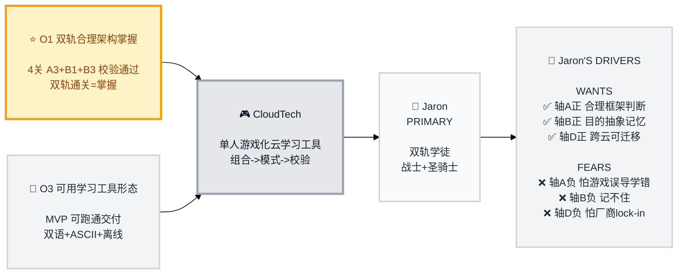

# Trigger Map Poster: CloudTech

> Visual overview connecting business goals to user psychology

**Created:** 2026-07-31 (step-02 基础), 2026-08-01 (step-07a hub 生成)
**Author:** Jaron
**Agent:** Saga (WDS Analyst)
**Methodology:** WDS v6, 基于 Effect Mapping (Balic & Domingues), 适配负面驱动力

---

## Strategic Documents

这是可视化总览。详细文档见：

- **[01-Business-Goals.md](01-Business-Goals.md)** - 完整 vision + SMART 目标
- **[02-Jaron-the-Dual-Track-Apprentice.md](02-Jaron-the-Dual-Track-Apprentice.md)** - Primary persona 完整画像 + driving forces
- **[06-Feature-Impact.md](06-Feature-Impact.md)** - 17 features 优先级 + impact scores
- **[05-Key-Insights.md](05-Key-Insights.md)** - Strategic implications

---

## Vision

CloudTech = 单人游戏化云学习工具，双重目的（构建中自学云计算 + 打磨成可用学习工具），把 AWS BuilderCards 组合->模式->讨论验证 内核做单人数字化、多云化（AWS+GCP+CF）；从句法（牌面 1:1 组合）到语义（参考架构）两层掌握 well-architected 模式。

---

## Business Objectives

### Objective 1: O1 双轨合理架构掌握（THE ENGINE）

- **Metric:** 4 关校验通过（战士 W1 静态站+W2 serverless；圣骑士 P1 三元组+P2 容器）；A3 句法 floor + B1 多参考语义匹配 + B3 WA 分阈值
- **Target:** 双轨 4 关全部校验通过 = 双轨通关
- **Timeline:** 点亮科技树执行序（里程碑制，hobby 无日历）

### Objective 2: O3 可用学习工具产品形态

- **Metric:** MVP 交付可跑通（学习闭环可跑）
- **Target:** MVP 交付
- **Timeline:** MVP 里程碑

### TERTIARY: N/A

非商业 personal/hobby，无社区层。O2 共享 WA 度量引擎折进 O1（a+b 引擎双轨共用 = O1 度量机制，非独立目标）。

---

## Target Group（Prioritized）

### 1. Jaron - 双轨学徒（PRIMARY）

**Priority Reasoning:** MVP 唯一用户；产品所有者+设计伙伴+目标用户三位一体。中文为产品语言（对比记忆语言锚），非客户细分。

> 自学云计算的构建者。以战士(Dev/serverless/构建面)+圣骑士(Ops/IaaS/控制面)双轨游玩，自由顺序两轨都通关，双轨合一遍治单一视角偏狭，抵达[守序]认知升维。认证不进范围（Cert-NO）。

**Key Positive Drivers（Wants）:**
- 轴A正 合理框架判断（A3+B1+B3 双层校验做可操作"何为合理"判断）
- 轴B正 目的抽象记忆（对比记忆 EN 术语 + CN 概念锚）
- 轴D正 跨云可迁移（多云参考集 + 云无关抽象 + S3/R2/GCS 变体）

**Key Negative Drivers（Fears）:**
- 轴A负 怕游戏误导学错（§15 过拟合红线四项检测 + 定量预算）
- 轴B负 记不住（对比记忆 + 通关后图谱->架构图映射）
- 轴D负 怕厂商 lock-in/三云记混（云无关抽象 + 变体对比 + 轴A互补）

---

## Trigger Map Visualization

---

> 渲染版 (mmdc 实渲染验证 PASS, 补 step-08h 空验): [00-trigger-map.svg](00-trigger-map.svg)

## Design Focus Statement

**MoSCoW Focus（step-05 定稿）:**

- **Must:** 轴A正（O1 双轨 4 关 A3+B1+B3 校验）+ 轴A负（§15 过拟合红线）
- **Should:** 轴B正（对比记忆 EN 规范术语 + CN 概念锚）+ 轴B负（通关后游戏图谱->云架构图映射）
- **Could:** 轴D正（多云参考集 + 云无关抽象 S3/R2/GCS 变体对比）+ 轴D负（若里程碑许可）
- **形（容器）:** O3（ASCII 形式即内容 + 终端 chrome + 离线 + 双语 + Lovable 栈）
- **执行序:** 先战士轨跑通闭环、严守不失真 -> 扩双轨+多云 -> 双轨通关 MVP

**Primary Design Target:** Jaron（双轨学徒）

**Must Address:** 轴A正 + 轴A负
**Should Address:** 轴B正 + 轴B负

---

## Summary: Transformation & Flywheel

### Key Transformation

**BEFORE:** 被动学文档/牌面，缺"此架构是否合理"判断练习；怕 soundness 判断缺失（学错）；BuilderCards 需 2 人+专家，非单人。

**AFTER:** 主动 组装->校验->判断 闭环（A3+B1+B3 可操作"何为合理"）；双轨治偏狭，[守序]认知升维（见两面，理解底层秩序）；掌握可迁移云概念，打磨成可用工具（O3）。

### The Flywheel（学习闭环，非社区飞轮）

1. ⭐ **解锁配额** - 分阶段解锁云资源
2. 🎮 **拖拽组装栈** - 服务牌组装云架构
3. 🔍 **双层校验** - A3 句法 floor + B1 多参考语义 + B3 WA 分阈值
4. ⚡ **XP 进阶** - 过校验得 XP（= WA 点），达阈值进阶
5. 🏆 **通关=掌握** - 合理架构判断达成
6. 💡 **点亮职业** - 完成一轨点亮科技树节点
7. ⚖️ **双轨[守序]** - 双轨通关解锁守序阵营（认知升维）

---

## Cross-Group Patterns

### Shared Drivers（内在二元）

Jaron 双轨 = 内在二元张力（非两个 persona）：
- **战士视（构建/速度）** - 盲点=忽视可靠性/成本
- **圣骑士视（守护/可用）** - 盲点=过度防御/成本失控
- **双轨合成 = [守序]认知升维** - 治双方偏狭

### Unique Drivers

- 战士轨专属：serverless 端到端交付判断（W1 静态站 + W2 serverless）
- 圣骑士轨专属：IaaS 控制面三元组判断（P1 EC2+VPC+EBS + P2 容器）
- CF 缺位=教学资产：圣骑士轨对 CF（无 IaaS）缺位 = 不对称战场，治偏狭

---

## How to Read

- **左->右流程:** Business Goals -> Platform -> Target Group -> Driving Forces
- **驱动符号:** ✅ = Want（正面驱动）, ❌ = Fear（负面驱动）
- **优先级:** ⭐ PRIMARY > 🚀 SECONDARY（TERTIARY N/A）
- **单 persona:** 1 Jaron + 2 子目标（战士/圣骑士），非多 persona

---

## Next Steps

- [ ] **Phase 3: UX Scenarios** - 场景大纲（Freya），基于 Must Have features 先设计
- [ ] **Phase 4: UX Design** - Lovable render loop（spec<->render），优先验：拖拽 x 字符网格 / ASCII 形变动效 / form=content 交互
- [ ] **参考 Feature Impact** - 6 Must Have 定设计优先级（受 MoSCoW 力优先级顶层支配, 轴D部分后扩）
- [ ] **更新文档** - 这是 living document，随学习进展更新

---

_Generated with Whiteport Design Studio (WDS v6) - Saga (WDS Analyst)_
_Trigger Mapping methodology: Effect Mapping by Mijo Balic & Ingrid Domingues (inUse), adapted with negative driving forces_
_Document language: Chinese_
